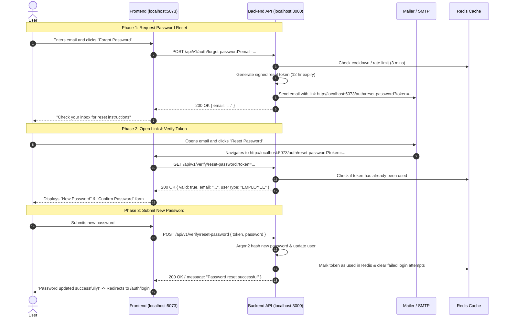

# Password Reset & Verification API Documentation

This document provides complete instructions for frontend developers and frontend AI agents to implement the **Forgot Password**, **Password Reset Verification**, and **Email Verification** flows.

---

## 1. Environment & Architecture Configuration

### Frontend Application URL
- **Frontend Origin**: `http://localhost:5073`
- **Configured in Backend `.env`**:
  ```env
  FRONTEND_URL=http://localhost:5073
  BASE_URL=http://localhost:3000
  ```
- **Reset Link Delivered in Email**:
  ```text
  http://localhost:5073/auth/reset-password?token=<JWT_RESET_TOKEN>
  ```
- **Frontend Route to Implement**:
  The frontend application must host a page/route at `/auth/reset-password` that reads the `token` query parameter from the URL.

---

## 2. End-to-End Authentication Workflow



---

## 3. API Endpoints Reference

### 1. Request Password Reset (Employee / General)

Initiates password recovery for an employee (falls back to customer if not found as employee). Sends a password reset email with a 12-hour valid link.

```http request
POST {{baseUrl}}/api/v1/auth/forgot-password?email=user@example.com
```

#### Query Parameters
| Parameter | Type | Required | Description |
| :--- | :--- | :--- | :--- |
| `email` | `string` | **Yes** | The registered user's email address |

#### Response (`200 OK` or `201 Created`)
```json
{
  "email": "user@example.com"
}
```

#### Error Responses
- **429 Too Many Requests** (Rate limited - 3 minute cooldown):
  ```json
  {
    "statusCode": 429,
    "message": "Please try again after some time",
    "errorCode": "TOO_MANY_REQUESTS"
  }
  ```
- **404 Not Found** (Account doesn't exist):
  ```json
  {
    "statusCode": 404,
    "message": "User with user@example.com not found",
    "code": "USER_NOT_FOUND"
  }
  ```

---

### 2. Request Password Reset (Customer-Specific)

Dedicated endpoint for customer portal password recovery.

```http request
POST {{baseUrl}}/api/v1/auth/forgot-password/customer?email=customer@example.com
```

#### Query Parameters
| Parameter | Type | Required | Description |
| :--- | :--- | :--- | :--- |
| `email` | `string` | **Yes** | The registered customer's email address |

#### Response (`200 OK` or `201 Created`)
```json
{
  "email": "customer@example.com"
}
```

#### Error Responses
- **429 Too Many Requests**: Cooldown active.
- **404 Not Found**:
  ```json
  {
    "statusCode": 404,
    "message": "Customer with customer@example.com not found",
    "code": "CUSTOMER_NOT_FOUND"
  }
  ```

---

### 3. Verify Reset Password Token

Verifies if the reset token received from the URL query string is valid, unexpired, and not yet consumed.  
**Frontend should call this on page mount before rendering the password reset form.**

```http request
GET {{baseUrl}}/api/v1/verify/reset-password?token={{token}}
```

#### Query Parameters
| Parameter | Type | Required | Description |
| :--- | :--- | :--- | :--- |
| `token` | `string` | **Yes** | The JWT token extracted from `?token=...` in the frontend URL |

#### Response (`200 OK`)
```json
{
  "valid": true,
  "email": "alex@fieldops.ai",
  "userType": "EMPLOYEE",
  "message": "Token is valid"
}
```
*(For a customer, `userType` will be `"CUSTOMER"`)*

#### Error Responses
- **401 Unauthorized** - Token expired:
  ```json
  {
    "statusCode": 401,
    "message": "Token has expired",
    "errorCode": "TOKEN_EXPIRED"
  }
  ```
- **401 Unauthorized** - Invalid or corrupted token:
  ```json
  {
    "statusCode": 401,
    "message": "Invalid token",
    "errorCode": "INVALID_TOKEN"
  }
  ```
- **400 Bad Request** - Token was already used (replay attack prevention):
  ```json
  {
    "statusCode": 400,
    "message": "Reset token has already been used",
    "errorCode": "INVALID_TOKEN"
  }
  ```
- **400 Bad Request** - Missing token query param:
  ```json
  {
    "statusCode": 400,
    "message": ["Token is required", "Token must be a string"],
    "error": "Bad Request"
  }
  ```

---

### 4. Reset Password (Submit New Password)

Consumes the token, updates the user's password with Argon2 hashing, marks the token as spent, and unlocks any account locks caused by prior failed login attempts.

```http request
POST {{baseUrl}}/api/v1/verify/reset-password
Content-Type: application/json

{
  "token": "eyJhbGciOiJIUzI1NiIsInR5cCI6IkpXVCJ9...",
  "password": "mySecureNewPassword123"
}
```

#### Request Body Schema
| Field | Type | Required | Constraints | Description |
| :--- | :--- | :--- | :--- | :--- |
| `token` | `string` | **Yes** | Non-empty | The reset token from the URL |
| `password` | `string` | **Yes** | Min length: 6 | The user's new password |

#### Response (`200 OK`)
```json
{
  "message": "Password reset successful"
}
```

#### Error Responses
- **400 Bad Request** - Password too short:
  ```json
  {
    "statusCode": 400,
    "message": ["Password must be at least 6 characters long"],
    "error": "Bad Request"
  }
  ```
- **400 Bad Request** - Token already used:
  ```json
  {
    "statusCode": 400,
    "message": "Reset token has already been used",
    "errorCode": "INVALID_TOKEN"
  }
  ```
- **401 Unauthorized** - Token expired or invalid:
  ```json
  {
    "statusCode": 401,
    "message": "Token has expired",
    "errorCode": "TOKEN_EXPIRED"
  }
  ```

---

### 5. Email Verification (Signup Flow)

For completeness, when a new organization owner registers, they receive an email link pointing to:
`GET {{baseUrl}}/api/v1/verify/email?token={{token}}`

#### Response (`200 OK`)
```json
{
  "message": "Verified"
}
```

---

## 4. Frontend Implementation Guide (React / Next.js / Vue)

### 1. TypeScript Types
```typescript
// types/auth.ts

export type UserType = 'EMPLOYEE' | 'CUSTOMER';

export interface VerifyResetTokenResponse {
  valid: boolean;
  email: string;
  userType: UserType;
  message: string;
}

export interface ResetPasswordPayload {
  token: string;
  password: string;
}

export interface ResetPasswordResponse {
  message: string;
}

export interface ForgotPasswordResponse {
  email: string;
}

export interface ApiError {
  statusCode: number;
  message: string | string[];
  errorCode?: string;
  code?: string;
}
```

### 2. Example Frontend Reset Password Component (React)

```tsx
// pages/auth/reset-password.tsx or app/auth/reset-password/page.tsx
import React, { useEffect, useState } from 'react';

const API_BASE = 'http://localhost:3000/api/v1';

export default function ResetPasswordPage() {
  const [token, setToken] = useState<string>('');
  const [isVerifying, setIsVerifying] = useState<boolean>(true);
  const [tokenValid, setTokenValid] = useState<boolean>(false);
  const [userEmail, setUserEmail] = useState<string>('');
  const [errorMessage, setErrorMessage] = useState<string>('');

  const [password, setPassword] = useState<string>('');
  const [confirmPassword, setConfirmPassword] = useState<string>('');
  const [isSubmitting, setIsSubmitting] = useState<boolean>(false);
  const [isSuccess, setIsSuccess] = useState<boolean>(false);

  // 1. Extract token from URL & verify on mount
  useEffect(() => {
    const searchParams = new URLSearchParams(window.location.search);
    const urlToken = searchParams.get('token');

    if (!urlToken) {
      setErrorMessage('Missing password reset token in URL.');
      setIsVerifying(false);
      return;
    }

    setToken(urlToken);

    // Call backend to verify token validity
    fetch(`${API_BASE}/verify/reset-password?token=${encodeURIComponent(urlToken)}`)
      .then(async (res) => {
        const data = await res.json();
        if (!res.ok) {
          throw new Error(data.message || 'Token verification failed');
        }
        return data;
      })
      .then((data) => {
        setTokenValid(true);
        setUserEmail(data.email);
      })
      .catch((err) => {
        setTokenValid(false);
        setErrorMessage(err.message || 'The reset link is invalid or has expired.');
      })
      .finally(() => {
        setIsVerifying(false);
      });
  }, []);

  // 2. Submit new password
  const handleSubmit = async (e: React.FormEvent) => {
    e.preventDefault();
    if (password.length < 6) {
      setErrorMessage('Password must be at least 6 characters.');
      return;
    }
    if (password !== confirmPassword) {
      setErrorMessage('Passwords do not match.');
      return;
    }

    setIsSubmitting(true);
    setErrorMessage('');

    try {
      const res = await fetch(`${API_BASE}/verify/reset-password`, {
        method: 'POST',
        headers: { 'Content-Type': 'application/json' },
        body: JSON.stringify({ token, password }),
      });

      const data = await res.json();
      if (!res.ok) {
        throw new Error(data.message || 'Failed to reset password');
      }

      setIsSuccess(true);
      // Optional: redirect to login page after 2 seconds
      setTimeout(() => {
        window.location.href = '/auth/login';
      }, 2000);
    } catch (err: any) {
      setErrorMessage(err.message || 'Something went wrong.');
    } finally {
      setIsSubmitting(false);
    }
  };

  if (isVerifying) {
    return <div className="p-8 text-center">Verifying reset link...</div>;
  }

  if (!tokenValid) {
    return (
      <div className="p-8 max-w-md mx-auto text-center">
        <h2 className="text-xl font-bold text-red-600 mb-2">Invalid or Expired Link</h2>
        <p className="text-gray-600 mb-4">{errorMessage}</p>
        <a href="/auth/forgot-password" className="text-blue-600 underline">
          Request a new password reset link
        </a>
      </div>
    );
  }

  if (isSuccess) {
    return (
      <div className="p-8 max-w-md mx-auto text-center">
        <h2 className="text-xl font-bold text-green-600 mb-2">Password Reset Successful!</h2>
        <p className="text-gray-600">Redirecting to login portal...</p>
      </div>
    );
  }

  return (
    <div className="max-w-md mx-auto p-6 bg-white rounded-lg shadow mt-10">
      <h2 className="text-2xl font-bold mb-2">Reset Password</h2>
      <p className="text-sm text-gray-500 mb-6">Resetting password for: <strong>{userEmail}</strong></p>

      {errorMessage && (
        <div className="p-3 mb-4 text-sm text-red-700 bg-red-100 rounded">
          {errorMessage}
        </div>
      )}

      <form onSubmit={handleSubmit} className="space-y-4">
        <div>
          <label className="block text-sm font-medium mb-1">New Password</label>
          <input
            type="password"
            value={password}
            onChange={(e) => setPassword(e.target.value)}
            required
            minLength={6}
            className="w-full px-3 py-2 border rounded"
            placeholder="At least 6 characters"
          />
        </div>

        <div>
          <label className="block text-sm font-medium mb-1">Confirm Password</label>
          <input
            type="password"
            value={confirmPassword}
            onChange={(e) => setConfirmPassword(e.target.value)}
            required
            minLength={6}
            className="w-full px-3 py-2 border rounded"
            placeholder="Re-enter password"
          />
        </div>

        <button
          type="submit"
          disabled={isSubmitting}
          className="w-full bg-blue-600 text-white py-2 rounded hover:bg-blue-700 disabled:opacity-50"
        >
          {isSubmitting ? 'Updating Password...' : 'Reset Password'}
        </button>
      </form>
    </div>
  );
}
```
